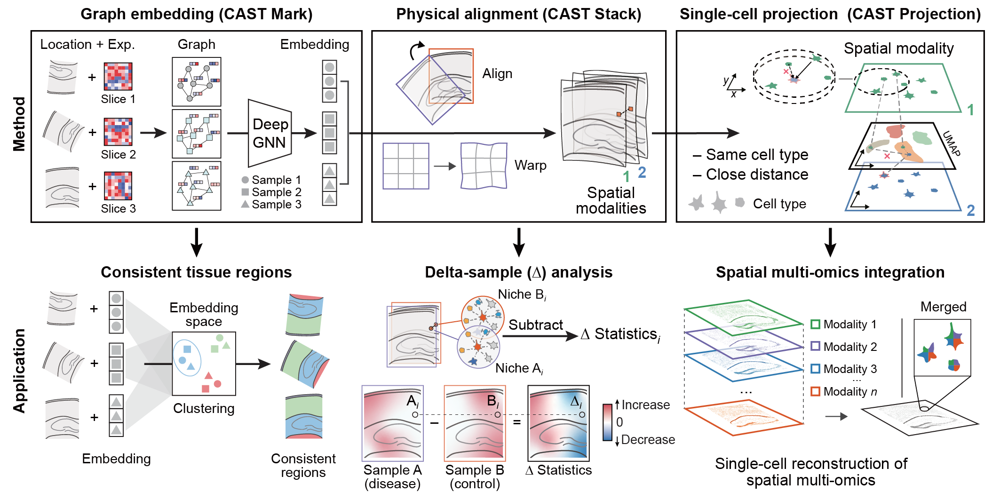

# Introduction
**CAST** is a Python library for physically aligning different spatial transcriptome regardless of technologies, magnification, individual variation, and experimental batch effects.
CAST is composed of three modules: CAST Mark, CAST Stack, and CAST Projection.


# Installation Guide

For Windows system, we suggest to use the `Anaconda powershell` to run following code.

## Requirements

- **[Optional]** It is recommended to create a conda environment for CAST.

For example, create a new environment named `cast_demo` and activate it.
```
conda create -y -n cast_demo python=3.9
conda activate cast_demo
```
- **[Optional]** CAST requires `pytorch` and `dgl`

[Install Pytorch](https://pytorch.org/get-started/locally/)

[Install DGL](https://www.dgl.ai/pages/start.html)

Users could use `nvcc --version` to check the CUDA version for installation.

Here we provide with an example of the CUDA `11.3` installation code.
```
#### If CPU only ####
conda install pytorch==1.11.0 cpuonly -c pytorch
conda install -c dglteam dgl

#### If GPU available ####
conda install -y -c pytorch pytorch==1.11.0 cudatoolkit=11.3
conda install -y -c dglteam dgl-cuda11.3==0.9.1
```

## Installation
If `git` is available:
```
pip install git+https://github.com/wanglab-broad/CAST.git
```
If `git` is unavailable:

1. Download the package and unpack it

2. run the code:
```
cd $package
pip install -e .
```

# Demo
We provide with several demos to demonstrate the functions in CAST package.

Users can use following code to open the `Jupyter notebook` (We recommend to use `Chrome` to open the jupyter notebook).
```
cd $demo_path
jupyter notebook

#### If remote kernel ####
jupyter notebook --ip=0.0.0.0 --port=8800

#### If dead kernel ####
jupyter notebook --NotebookApp.max_buffer_size=21474836480
```
## Demo 1 CAST_Mark
In this demo, CAST_Mark can captures the common spatial features across multiple samples

Users should first replace `$demo_path` with the CAST demo Path in the first cell.

## Demo 2 CAST_Stack_Align_S4_to_S1
In this demo, Stack_Align can align two samples together.

Users should first replace `$demo_path` with the CAST demo Path in the first cell.

## Demo 3 CAST_project
In this demo, CAST_projectiong will project one sample to another one.

Users should first replace `$demo_path` with the CAST demo Path in the first cell.

## More demos
We also updated more demos in the [tutorial pages](https://cast-tutorial.readthedocs.io/en/latest/).

